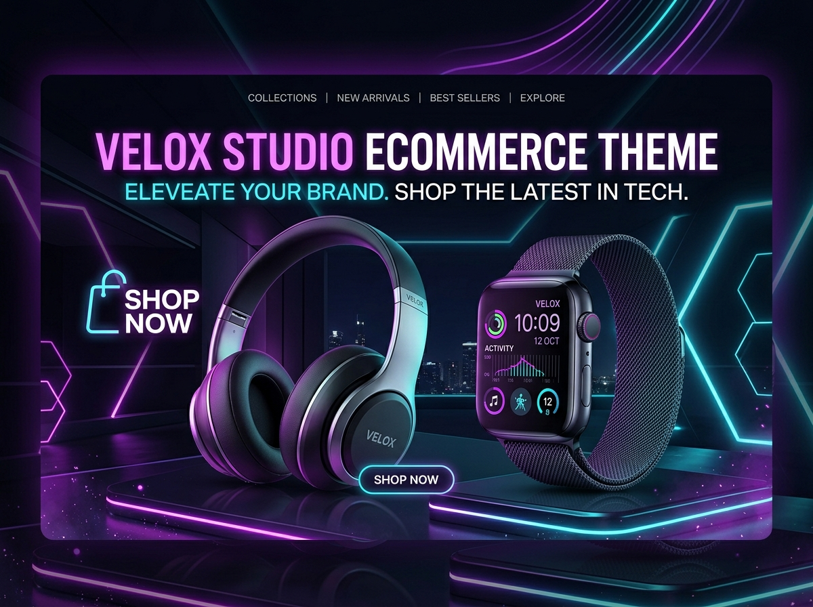

# VELOX - Modern WordPress eCommerce Theme

[](https://wordpress.org/)
[](https://www.gnu.org/licenses/gpl-2.0.html)
[](https://php.net)

A sleek, high-converting WordPress eCommerce theme and storefront landing page built with modern glassmorphism, instant slide-over shopping cart, interactive product quick-view modal, live flash sale countdown, and dynamic category filtering.



## ✨ Key Features

- **⚡ Glassmorphic Sticky Header**: Announcement bar with countdown timer, live copyable promo codes, and real-time bag total & item counters.
- **🛍️ Interactive Slide-Over Cart Drawer**: Slide-out shopping cart with quantity selectors, promo code verification (`LUXE50` for 15% off), and a dynamic Free Shipping tracker.
- **🔍 Instant Product Quick View Modal**: Interactive product preview with color swatches, image gallery switcher, and spec highlights without page reload.
- **🏷️ Dynamic Category & Tab Filtering**: Instant client-side filtering across Audio, Smart Tech, Workspace EDC, and Lifestyle collections.
- **🔥 Limited Flash Deals & Countdown**: Real-time ticker with bundled product savings and stock progress meters.
- **🎯 Flagship Spotlight**: Product showcase with interactive spec hotspots.
- **⭐ Social Proof & FAQs**: Verified buyer reviews, rating breakdowns, and expandable FAQ accordions.
- **📱 Fully Responsive**: Tailored for mobile, tablet, and ultra-wide displays with smooth micro-interactions.
- **🛒 Standalone & WooCommerce Ready**: Works out-of-the-box with seed catalog items in `localStorage`, and declares full `add_theme_support('woocommerce')` compatibility.

## 📁 File Structure

```text
ecommerce/
├── style.css                 # Theme metadata and WordPress headers
├── functions.php             # Enqueue scripts/styles, catalog provider, theme supports
├── header.php                # Announcement bar, sticky glass navbar, search modal
├── footer.php                # VIP newsletter, trust guarantees, footer columns
├── front-page.php            # Primary landing page template
├── index.php                 # Fallback template
├── screenshot.png            # Theme preview card for WP Admin
├── template-parts/
│   ├── section-hero.php          # Hero section with dual CTAs and floating stats
│   ├── section-categories.php    # Visual category cards with zoom effects
│   ├── section-products.php      # Filterable product grid with swatches & badges
│   ├── section-spotlight.php     # Flagship product spotlight with interactive hotspots
│   ├── section-flash-deals.php   # Hardware bundles with live countdown timer
│   ├── section-reviews.php       # Testimonials, ratings bar, and FAQ accordion
│   ├── drawer-cart.php           # Slide-over cart drawer with free shipping bar
│   └── modal-quickview.php       # Product quick-view modal dialog
└── assets/
    ├── css/
    │   └── ecommerce.css         # Modern Vanilla CSS design system
    └── js/
        └── ecommerce.js          # Cart state, quick view, filter, countdown & toasts
```

## 🚀 Installation & Setup

1. Download or clone this repository into your WordPress themes folder:
   ```bash
   cd wp-content/themes/
   git clone https://github.com/ahanaf607307/ecommerce-theme.git ecommerce
   ```
2. In your WordPress Admin Dashboard, navigate to **Appearance > Themes**.
3. Locate **Ecommerce (VELOX)** and click **Activate**.
4. Visit your site homepage to experience the storefront!

## 🛠️ Tech Stack

- **HTML5 & PHP 8.x**
- **Vanilla CSS3** (Custom design tokens, Flexbox, CSS Grid, Glassmorphism)
- **Vanilla ES6+ JavaScript** (Local storage cart state, live events)
- **Google Fonts**: *Outfit* (Display headings) & *Plus Jakarta Sans* (Body & UI)
- **FontAwesome 6**

## 📄 License

This project is licensed under the [GNU General Public License v2 or later](LICENSE).
